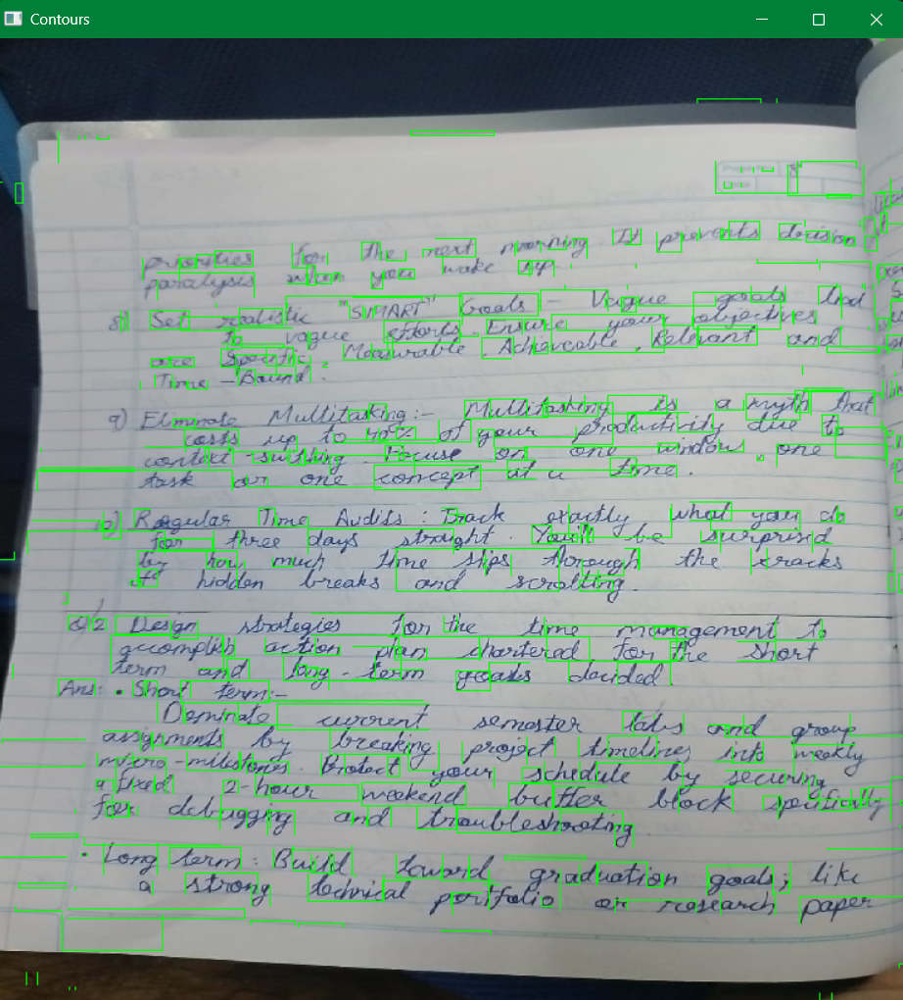

# Handwriting Page Scanner

Detects and highlights word-level regions in a scanned or photographed handwritten notebook page using OpenCV. Also includes a Tesseract OCR pipeline to attempt text extraction.

---

## Scripts

| Script | What it does |
|--------|-------------|
| `contour_detection.py` | Detects word regions and draws green bounding boxes |
| `ocr_pipeline.py` | Attempts to extract text from the page using Tesseract OCR |

---

## Setup

```bash
pip install opencv-python numpy pytesseract
```

For `ocr_pipeline.py`, also install Tesseract:
- Download from: https://github.com/UB-Mannheim/tesseract/wiki
- Default install path: `C:\Program Files\Tesseract-OCR\`

---

## Usage

**Contour Detection:**
1. Clone the repo
2. Change the image path in `contour_detection.py` to your own file
3. Run:
```bash
python contour_detection.py
```
The script opens a resizable window showing the detected regions. Press any key to close.

**OCR Pipeline:**
1. Change the image path in `ocr_pipeline.py` to your own file
2. Run:
```bash
python ocr_pipeline.py
```
Extracted text is printed to the terminal.

---

## Code Walkthrough

### contour_detection.py

```python
img = cv2.imread(r"path\to\image.jpg")
```
Loads the image as a NumPy array — a 3D grid of numbers (height × width × 3 color channels).

```python
gray = cv2.cvtColor(img, cv2.COLOR_BGR2GRAY)
```
Converts to grayscale — one number per pixel instead of three. Required before thresholding.

```python
thresh = cv2.adaptiveThreshold(
    gray, 255,
    cv2.ADAPTIVE_THRESH_GAUSSIAN_C,
    cv2.THRESH_BINARY_INV,
    13, 4
)
```
Converts grayscale to pure black and white. `THRESH_BINARY_INV` inverts the output so ink is white and paper is black — required for contour detection. `ADAPTIVE` means the threshold is calculated block by block across the image, which handles uneven lighting and ink bleed-through from the back of the page much better than a single global threshold.

- `13` — block size: how many surrounding pixels to consider when deciding if a pixel is ink or paper. Must be odd. Higher = smoother but may miss detail.
- `4` — constant: subtracted from the calculated threshold. Higher = thinner ink. Lower = bolder ink.

```python
contours, _ = cv2.findContours(thresh, cv2.RETR_EXTERNAL, cv2.CHAIN_APPROX_SIMPLE)
```
Finds all connected white regions (ink blobs) in the binary image. `RETR_EXTERNAL` returns only outermost contours, ignoring holes inside letters like `o` or `e`.

```python
x, y, w, h = cv2.boundingRect(cnt)
if 5 < w < 200 and 5 < h < 70:
```
Gets the bounding box for each contour and filters by size — removes tiny noise dots (too small) and large blobs like the page border (too large). These values were tuned to match the actual letter sizes in the scanned image.

```python
cv2.rectangle(output, (x, y), (x+w, y+h), (0, 255, 0), 1)
```
Draws a green rectangle on a copy of the original image. `(0, 255, 0)` is green in BGR. `1` is the line thickness.

---

### ocr_pipeline.py

```python
pytesseract.pytesseract.tesseract_cmd = r"C:\Program Files\Tesseract-OCR\tesseract.exe"
```
Points Python to the Tesseract installation. Required on Windows.

```python
cropped = gray[100:1500, 50:850]
```
Crops out the noisy edges of the page — spiral binding, dark borders — before passing to Tesseract. Format is `[y_start:y_end, x_start:x_end]`.

```python
text = pytesseract.image_to_string(thresh, config="--psm 11")
```
Runs OCR on the thresholded image. `--psm 11` tells Tesseract to treat the input as sparse text and find as much as possible, rather than assuming a clean document layout.

**Note on accuracy:** Tesseract was trained on printed fonts, not handwriting. Accuracy on cursive handwriting is very low (~1%) regardless of preprocessing. This is a fundamental limitation of the tool, not a code issue — it's why neural approaches to handwriting recognition exist.

---

## Tuning Parameters

If detection is off on your image, these are the values to adjust:

| Parameter | Location | Effect |
|-----------|----------|--------|
| `13` (block size) | `adaptiveThreshold` | Higher = smoother, lower = more detail |
| `4` (constant) | `adaptiveThreshold` | Higher = thinner ink, lower = bolder |
| `5 < w < 200` | filter | Adjust for your letter width in pixels |
| `5 < h < 70` | filter | Adjust for your letter height in pixels |

To find the right filter values for your image, print all contour sizes before filtering:

```python
for cnt in contours:
    x, y, w, h = cv2.boundingRect(cnt)
    print(f"w={w}, h={h}")
```



---

## Known Limitations

- Ruled lines on notebook paper sometimes get detected — can be filtered with `w < 3 * h`
- Letters that touch each other may get grouped into one box
- Very light ink or heavy bleed-through may need threshold tuning
- Tesseract OCR has very low accuracy on cursive handwriting — neural approaches are needed for reliable handwriting recognition

---

## Dependencies

- Python 3.x
- OpenCV (`cv2`)
- NumPy
- Tesseract OCR
- pytesseract
